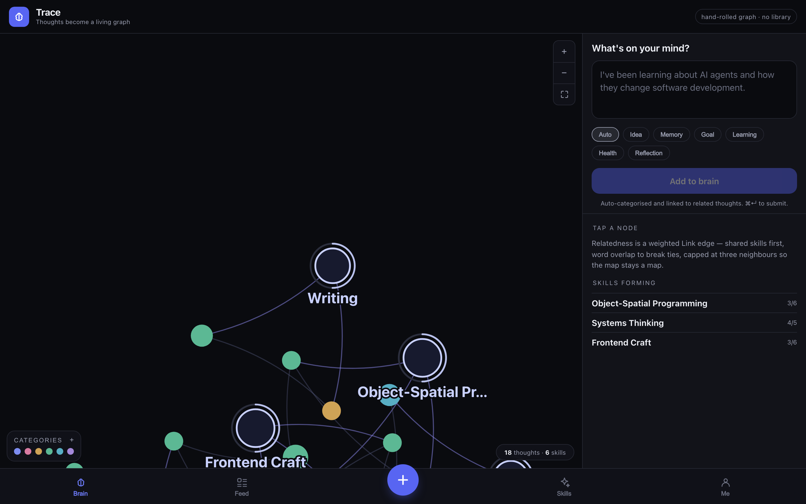
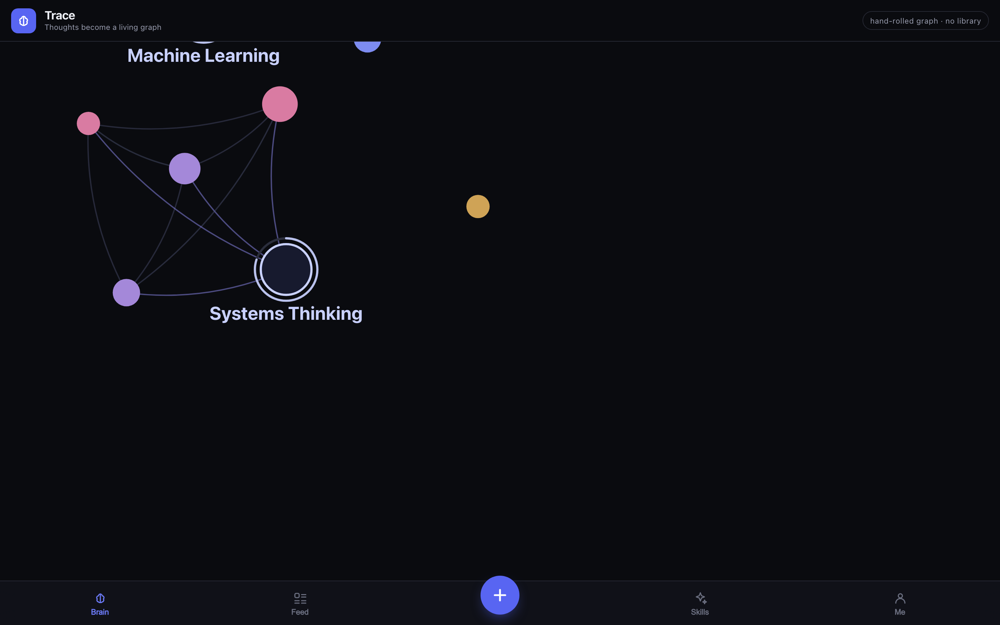

# Trace

## The second brain that remembers how you remember.

Trace turns thoughts into a living knowledge graph, connecting memories, skills, and goals to reveal patterns in how you learn.

**[Live demo](https://amberkaurtoor-09.github.io/Trace/)** · **[GitHub](https://github.com/amberkaurtoor-09/Trace)**



Built at Jac Hacks (Founders Inc. SF / Jaseci Labs), June 2026.

---

## What is Trace?

Drop a thought in plain language. Trace categorizes it, links related memories, and grows **skills** from repeats. The graph is the product — not a notes list with a visualization bolted on.

It is inspired by knowledge graphs, Obsidian-style connected notes, and curiosity mapping: relationships between ideas should be visible, so you can see what to explore next. The “brain” language is a metaphor, not a claim about neural activity.

```text
thought  →  relationship  →  skill  →  goal  →  curiosity / next path
```

## Why I built it

Note apps store what you already wrote. Trace is about **what connects**, and what that suggests you might work on next. I wanted a recruiter (or anyone) to add one thought and watch it land on a living map — without installing anything.

## How it works

1. Capture a thought (or try the example in the demo).
2. Trace files a category and scores relatedness against existing thoughts.
3. A `Link` edge is stored with a reason (shared skill and/or word overlap).
4. A `Builds` edge points at any skill the thought moved forward.
5. The graph highlights that neighbourhood; **Explore your curiosity** lights a skill and the thoughts that feed it.



The [live demo](https://amberkaurtoor-09.github.io/Trace/) is a browser build of this loop. No Jac install.

## Technical architecture

```text
Composer  ──create_thought──►  wire_thought()
                                   │
                                   ├─ classify (keyword categories)
                                   ├─ match_skills  →  Thought --Builds--> Skill
                                   └─ peer score    →  Thought --Link--> Thought
                                                        reason stored on the edge

LoadBrain walker (Jac)
  visits every Thought / Skill from root
  force-layout (phyllotaxis seed, deterministic)
  reports GraphNode / GraphLink / SkillView

BrainGraph / demo Graph
  hand-rolled camera (no vis.js / D3)
  pan, wheel zoom, glide-to-node
  bezier edges; neighbourhood focus
```

The static demo in `demo/` uses the same scoring rules in TypeScript so the public URL works without a Python server.

## Key engineering decisions

| Decision | Why |
|---|---|
| Directed **Devin** against a written spec | Spec + review, not autocomplete |
| Custom graph engine, **no vis.js / D3** | Camera, layout, and highlight are application code |
| Relatedness = 0.65 × shared skills + 0.35 × word overlap, max 3 peers | Measured on the seed corpus: pure overlap peaked at 0.14 and half its top pairs were coincidence |
| Inspectable `Link.reason` | You can see *why* two thoughts linked |
| Skills are derived (`Builds` edges), not typed in | Mastery rings count connected thoughts — not a measured ability score |
| Jac object-spatial graph | The Jac app *is* a graph, not a table with a drawing on top |
| Optimistic submit + rollback in the Jac app | Instant UI; a failed write restores the previous graph |

Compile-to-JS issues found in the Jac client (if you read that code): `len()` of a dict compiles to `undefined`; `glob`s are module-local; inline `<span>` bars ignored height.

## Demo

- **Live:** [amberkaurtoor-09.github.io/Trace](https://amberkaurtoor-09.github.io/Trace/)
- Try **Explore your curiosity** — tap Public Speaking and watch thought → skill light up.
- **Try:** *I struggled to explain my project without looking at my slides.* then **+ Add thought**.

Jac app (full stack, local):

```bash
pip install jaclang
jac start --dev main.jac
```

Static demo:

```bash
cd demo
npm install
npm run dev
```

## What I would build next

- Persist the Jac graph so a session survives reload without reseeding.
- Glide + auto-fit parity between the Jac camera and the static demo.
- A tighter “next path” ranking that uses goal-category thoughts explicitly, still without inventing edges.

## Project layout

```text
main.jac              # Jac entry
endpoints.sv.jac      # graph model, LoadBrain, create/delete/seed
frontend.cl.jac       # Jac UI shell
frontend.impl.jac     # optimistic submit, auto-seed
demo/                 # browser demo (GitHub Pages)
components/           # Jac graph, composer, feed, skills
```

React 18 + TypeScript + Vite · Jac / Jaseci · no external graph library
